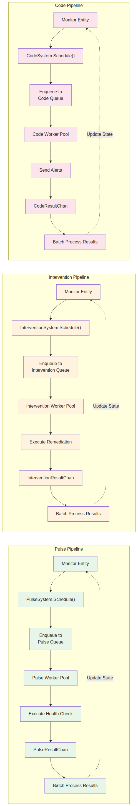
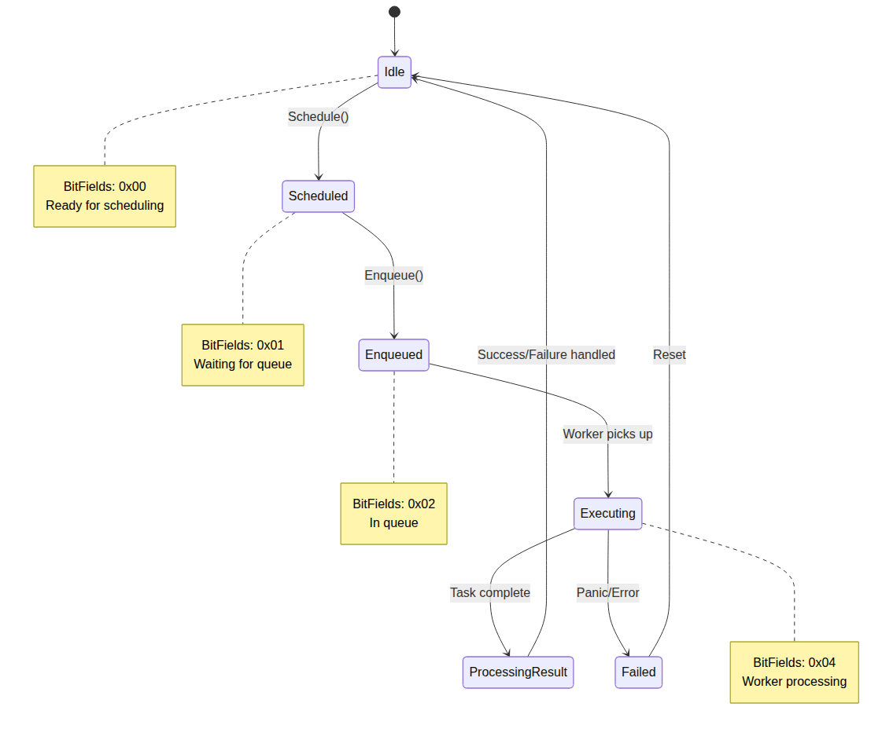

# CPRA Architecture Overview

This document provides a comprehensive overview of the CPRA (Concurrent Pulse-Remediation-Alerting) system architecture, designed to efficiently manage and process 1,000,000+ concurrent health monitors.

## Table of Contents

1. [System Design Philosophy](#system-design-philosophy)
2. [Entity-Component-System (ECS) Architecture](#entity-component-system-ecs-architecture)
3. [Three Pipeline Architecture](#three-pipeline-architecture)
4. [Queue and Worker Pool Layer](#queue-and-worker-pool-layer)
5. [Monitor Lifecycle](#monitor-lifecycle)
6. [Performance Characteristics](#performance-characteristics)

---

## System Design Philosophy

CPRA is built on three core architectural principles:

### 1. Data-Oriented Design
Instead of object-oriented patterns that can lead to cache misses and pointer chasing, CPRA uses a data-oriented approach through the Entity-Component-System (ECS) pattern. This provides:
- **Cache-friendly data layout**: Components are stored in contiguous memory
- **Efficient batch processing**: Systems process components in tight loops
- **Minimal allocation overhead**: Entities are just integer IDs

### 2. Three-Tier Processing Model
Health monitoring is decomposed into three independent pipelines:
- **Pulse**: Health checks (e.g., HTTP requests, TCP probes)
- **Intervention**: Automated remediation (e.g., restart services, scale resources)
- **Code**: Alert notifications (e.g., email, SMS, webhooks)

Each pipeline operates independently with its own queue and worker pool, enabling:
- Pipeline-specific tuning and scaling
- Fault isolation (one pipeline failure doesn't affect others)
- Clear separation of concerns

### 3. Queueing Theory-Based Scaling
Worker pools dynamically scale based on:
- **M/M/c queue analysis**: Mathematical modeling of arrival rates and service times
- **Allen-Cunneen approximation**: Variability inflation for realistic workloads
- **SLO-driven worker sizing**: Automatically determines worker count to meet latency targets

---

## Entity-Component-System (ECS) Architecture


### Overview

CPRA uses the [mlange-42/ark](https://github.com/mlange-42/ark) ECS library to manage monitor state and configuration. This pattern separates:

- **Entities**: Unique monitor IDs (just integers)
- **Components**: Data attached to entities (state, configuration)
- **Systems**: Logic that processes entities with specific components

### Components

Each monitor entity can have multiple components attached:

| Component | Purpose | Key Fields |
|-----------|---------|------------|
| `MonitorState` | Core state tracking | ID, Status, LastPulseTime, ErrorCount |
| `PulseConfig` | Health check configuration | URL, Method, Headers, Timeout, ExpectedStatus |
| `InterventionConfig` | Remediation logic | TriggerConditions, RemediationScript, RetryPolicy |
| `CodeConfig` | Alert settings | Recipients, Channels, Templates, ThrottleRules |

### Systems

Three primary systems process monitors:

1. **PulseSystem**: Schedules health checks and enqueues them to the Pulse queue
2. **InterventionSystem**: Schedules remediation tasks when monitors fail
3. **CodeSystem**: Schedules alert notifications based on trigger conditions

### Benefits

- **Memory efficiency**: Components stored in columnar layout (cache-friendly)
- **Query performance**: Fast filtering by component type (e.g., "all monitors with PulseConfig")
- **Composition flexibility**: Monitors can have any combination of components
- **Minimal allocations**: No per-monitor objects or pointers

---

## Three Pipeline Architecture



### Pipeline Flow

Each pipeline follows the same flow pattern:

1. **Schedule**: System identifies monitors ready for processing
2. **Enqueue**: Jobs are added to pipeline-specific queue
3. **Execute**: Worker pool picks up jobs and executes them
4. **Result Processing**: Results are batched and processed to update entity state
5. **Feedback Loop**: State updates trigger next scheduling cycle

### Pulse Pipeline

**Purpose**: Execute health checks to determine monitor status

**Execution**:
- HTTP/HTTPS requests with configurable methods, headers, timeouts
- TCP socket connections for network service checks
- Custom health check scripts via exec

**Result Handling**:
- Updates `MonitorState` with success/failure status
- Records response time metrics
- Increments error counters on failure
- Triggers Intervention pipeline if threshold exceeded

### Intervention Pipeline

**Purpose**: Automated remediation when monitors fail

**Execution**:
- Execute remediation scripts (bash, Python, etc.)
- Call external APIs for resource scaling
- Restart services via systemd/docker/kubernetes APIs
- Custom remediation logic

**Result Handling**:
- Records remediation outcome (success/failure)
- Updates `MonitorState` with remediation timestamp
- Triggers Code pipeline if remediation fails
- Resets error counters on successful remediation

### Code Pipeline

**Purpose**: Send alert notifications to humans

**Execution**:
- Email via SMTP
- SMS via Twilio/AWS SNS
- Webhook notifications to incident management systems
- Custom alert handlers

**Result Handling**:
- Records notification delivery status
- Implements throttling to prevent alert storms
- Tracks acknowledgment status
- Updates alert history

### Pipeline Independence

Key architectural decision: Pipelines are **completely independent**. This means:

- Each pipeline has its own queue and worker pool
- Pipeline failures are isolated
- Pipelines can be scaled independently
- Different queue implementations can be used per pipeline

---

## Queue and Worker Pool Layer


### Queue Interface

All queues implement the `TaskQueue` interface:

```go
type TaskQueue interface {
    Enqueue(job Job) error
    Dequeue() (Job, error)
    Len() int
}
```

### Queue Implementations

| Implementation | Data Structure | Use Case |
|----------------|----------------|----------|
| `HybridQueue` | Ring buffer + Min-heap | Priority-based scheduling with fairness |
| `AdaptiveQueue` | Auto-scaling ring buffer | Variable load with occasional spikes |
| `WorkivaQueue` | Lock-free ring buffer | Ultra-low latency requirements |

### Dynamic Worker Pool

The `DynamicWorkerPool` provides:

1. **Worker Management**
   - Goroutine pool via [panjf2000/ants](https://github.com/panjf2000/ants)
   - Configurable min/max worker counts
   - Graceful scaling up/down

2. **Queueing Theory-Based Scaling**
   - **M/M/c model**: Markovian arrival process, exponential service times, c servers
   - **Allen-Cunneen approximation**: Handles variability in real-world workloads
   - **SLO-driven sizing**: Calculates optimal worker count to meet latency targets

3. **Result Routing**
   - Type-specific result channels (PulseResultChan, InterventionResultChan, CodeResultChan)
   - Batched result processing to reduce state update overhead
   - Backpressure handling to prevent result channel overflow

### Scaling Algorithm

The worker pool scales based on:

```
λ = arrival rate (jobs/sec)
μ = service rate per worker (jobs/sec)
ρ = λ/(c×μ) = utilization
c = number of workers

Target: P(wait > SLO) < tolerance (e.g., 95% of jobs processed within 100ms)
```

The `FindCForSLO()` function iteratively searches for the minimum `c` that meets the SLO target, accounting for:
- Coefficient of variation in arrival times (Ca)
- Coefficient of variation in service times (Cs)
- Desired headroom percentage (e.g., 20% buffer)

---

## Monitor Lifecycle



### State Transitions

Monitors progress through the following states:

1. **Idle** (BitFields: 0x00)
   - Monitor is ready for scheduling
   - No active jobs in any pipeline

2. **Scheduled** (BitFields: 0x01)
   - System has identified the monitor for processing
   - Waiting to be enqueued

3. **Enqueued** (BitFields: 0x02)
   - Job is in the queue
   - Waiting for an available worker

4. **Executing** (BitFields: 0x04)
   - Worker is actively processing the job
   - HTTP request, script execution, or alert sending in progress

5. **ProcessingResult** (BitFields: 0x08)
   - Job execution complete
   - Result is being written to result channel and batched for state update

6. **Failed** (BitFields: 0x10)
   - Job encountered an error or panic
   - Monitor will be reset to Idle and potentially rescheduled

### State Management

States are managed using **bitfields** (uint32) rather than enums for:
- **Atomicity**: CAS operations for lock-free state updates
- **Multi-state tracking**: A monitor can be in multiple pipelines simultaneously
- **Efficiency**: Minimal memory footprint per monitor

Example: A monitor can be simultaneously:
- Executing a Pulse health check (0x04)
- Enqueued for Code alert (0x02)

Bitfield value: `0x04 | 0x02 = 0x06`

---

## Performance Characteristics

### Scalability

- **Entities**: 1,000,000+ concurrent monitors
- **Throughput**: 10,000+ health checks per second per pipeline
- **Latency**: P95 < 100ms from schedule to result processing (configurable via SLO)
- **Memory**: ~100 bytes per monitor (depending on component configuration)

### Bottleneck Analysis

Potential bottlenecks and mitigations:

| Bottleneck | Mitigation |
|------------|------------|
| Queue contention | Lock-free queues (WorkivaQueue) or sharded queues |
| Result channel backpressure | Batched result processing, buffered channels |
| State update lock contention | CAS-based bitfield updates, atomic operations |
| Worker pool overhead | Goroutine pooling via Ants, reusable worker goroutines |

### Resource Requirements

For 1,000,000 monitors with 1-minute pulse intervals:

```
Arrival rate: 1,000,000 / 60 = 16,667 jobs/sec
Service time: 50ms average (0.05 sec)
Service rate per worker: 1 / 0.05 = 20 jobs/sec
Utilization target: 70% (ρ = 0.70)
Workers needed: 16,667 / (20 × 0.70) ≈ 1,191 workers

With 20% headroom: 1,191 × 1.20 ≈ 1,429 workers
```

Memory usage:
- Monitor state: 1M × 100 bytes = 100 MB
- Worker goroutines: 1,429 × 2 KB = 2.86 MB
- Queue overhead: ~10 MB (depending on implementation)
- **Total**: ~113 MB for monitor state and workers

---

## Implementation References

- **ECS Library**: [mlange-42/ark](https://github.com/mlange-42/ark) - High-performance entity-component-system
- **Worker Pool**: [panjf2000/ants](https://github.com/panjf2000/ants) - Goroutine pool with dynamic scaling
- **Queue (lock-free)**: [Workiva/go-datastructures](https://github.com/Workiva/go-datastructures) - Ring buffer queue
- **Queueing Theory**: M/M/c model with Allen-Cunneen approximation for non-Markovian workloads

---

## Further Reading

- [API Reference](../reference/api-reference.md): Detailed function signatures and usage
- [Types Reference](../reference/types-reference.md): Data structures and component definitions
- [How-To Guide](../guides/how-to-common-tasks.md): Common configuration and operational tasks
- [Quickstart](../guides/quickstart.md): Get a basic monitor running in 5-10 minutes
