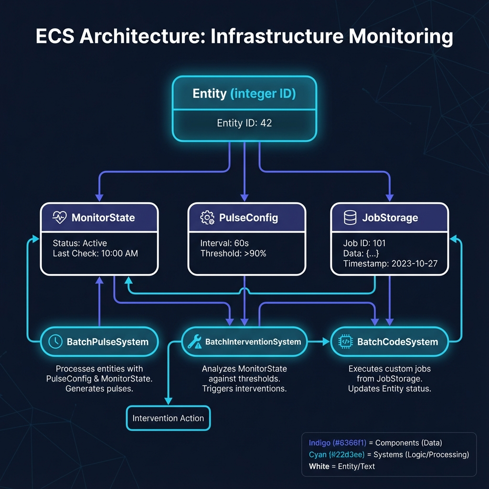
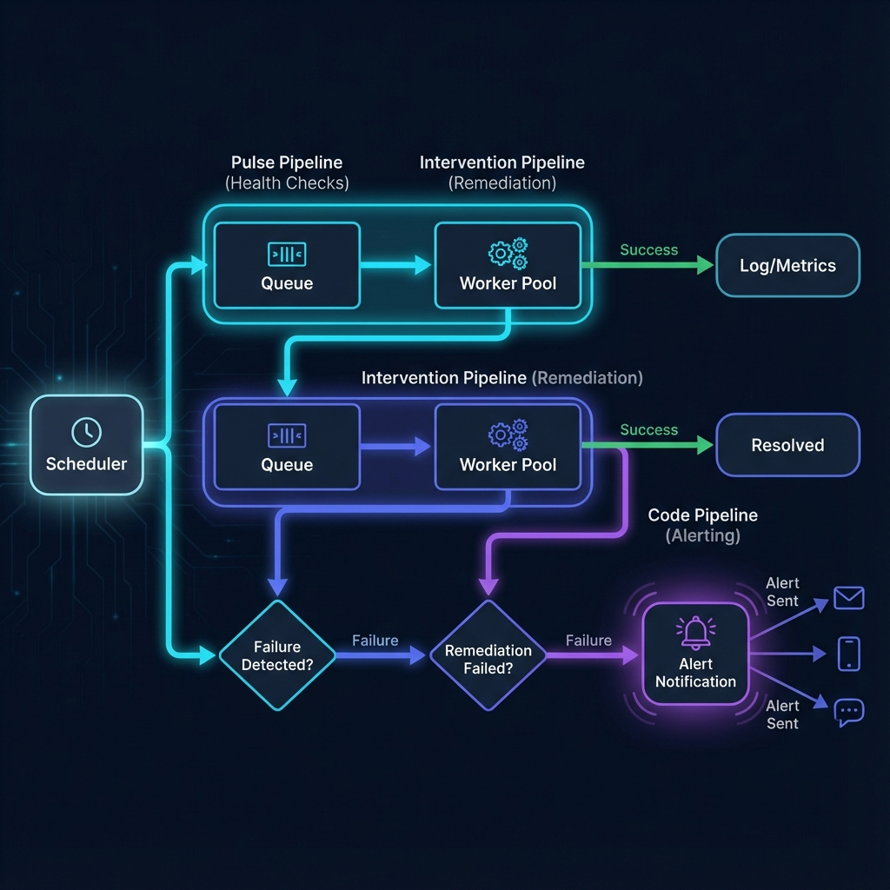
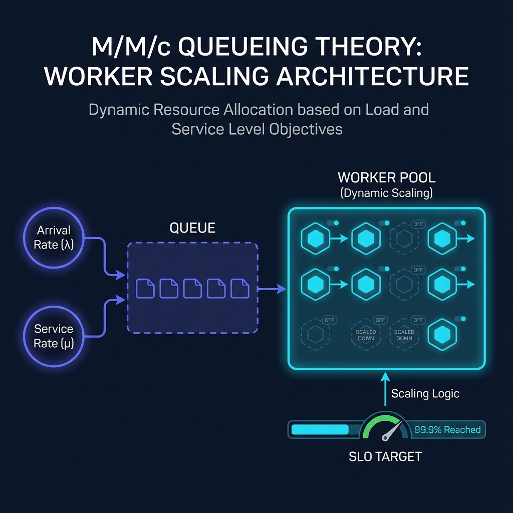

# Architecture Overview: The ECS Core

CPRA's architecture is built on a high-performance, data-oriented design centered around the **Entity-Component-System (ECS)** pattern. This design choice is fundamental to CPRA's ability to scale to over a million concurrent monitors with minimal memory footprint and exceptional throughput.

!!! tip "Key Insight"
    By separating data (components) from behavior (systems), ECS enables cache-friendly memory access patterns that dramatically improve performance at scale.

---

## 1. Entity-Component-System (ECS)

CPRA uses the ECS pattern to separate data from behavior—a technique borrowed from high-performance game engines and adapted for infrastructure monitoring. This architectural choice delivers multiple benefits:

- **Cache Efficiency**: Components stored contiguously in memory maximize CPU cache hits
- **Parallelization**: Systems can process components in batches without locks
- **Composability**: New component types and systems can be added without modifying existing code
- **Memory Efficiency**: Only ~100 bytes per monitor vs. traditional object-oriented approaches



### ECS Components Explained

| Element | Role in CPRA | Technical Implementation | Memory Impact |
| :--- | :--- | :--- | :--- |
| **Entity** | Unique monitor identifier | Simple integer ID (8 bytes) | Minimal |
| **Component** | Data and configuration | Structs: `MonitorState`, `PulseConfig`, `InterventionConfig`, `CodeConfig` | ~100 bytes total |
| **System** | Processing logic | Functions: `BatchPulseSystem`, `BatchInterventionSystem`, `BatchCodeSystem` | Zero (shared) |

### Memory Layout Advantage

Traditional object-oriented monitoring stores each monitor as a complete object:

```
Monitor Objects (OOP):
[Monitor1: {id, pulse, intervention, code, state...}]
[Monitor2: {id, pulse, intervention, code, state...}]
[Monitor3: {id, pulse, intervention, code, state...}]
→ Cache misses when processing multiple monitors
```

ECS stores components separately by type:

```
ECS Components:
MonitorStates:     [state1, state2, state3, ...]
PulseConfigs:      [pulse1, pulse2, pulse3, ...]
InterventionConfigs: [int1, int2, int3, ...]
→ Sequential access = cache friendly
```

---

## 2. The Three Independent Pipelines

Monitoring tasks are divided into three distinct, concurrent pipelines. This separation provides **fault isolation** and allows each pipeline to be optimized for its specific workload characteristics.



### Pipeline Characteristics

| Pipeline | Primary Function | Volume | Latency Target | Triggered By |
| :--- | :--- | :--- | :--- | :--- |
| **Pulse** | Health Check Detection | High (10,000+ ops/sec) | < 50ms | Scheduled intervals |
| **Intervention** | Automated Remediation | Medium (100s ops/sec) | < 500ms | Pulse failures |
| **Code** | Alert Notifications | Low (10s ops/sec) | < 1000ms | Intervention failures |

### Why Separate Pipelines?

**Problem**: In monolithic systems, a slow alerting operation (e.g., email timeout) can block health checks, causing cascading failures.

**Solution**: CPRA isolates each concern:

```
Pulse ──failure──> Intervention ──failure──> Code
  ↓                    ↓                        ↓
Queue                Queue                   Queue
  ↓                    ↓                        ↓
Workers              Workers                 Workers
```

**Key Benefits**:

1. **Fault Isolation**: Backlog in Code pipeline never affects Pulse
2. **Independent Scaling**: Each pipeline scales workers based on its own load
3. **SLO Guarantee**: Each pipeline can maintain its latency target independently
4. **Operational Clarity**: Clear separation of concerns for debugging and optimization

---

## 3. Data-Oriented Optimizations

To support 1,000,000+ monitors, CPRA employs several advanced optimization techniques:

### Component Consolidation

Instead of many small components, CPRA uses a few large, well-designed components to minimize ECS "archetypes" (component combinations):

```go
// Core state consolidated into one component
type MonitorState struct {
    LastCheck      time.Time    // 8 bytes
    NextCheck      time.Time    // 8 bytes
    FailureCount   uint8        // 1 byte
    Status         uint8        // 1 byte
    // ... total: ~32 bytes
}
```

**Impact**: Fewer archetypes = less memory overhead and faster queries.

### String Interning

Common strings (URLs, script paths, alert templates) are stored once in a global pool. Monitors hold pointers instead of copies:

```go
// Instead of 1M copies of "https://api.example.com/health"
// Store once, reference 1M times
urlPool := map[string]*string{}
monitor.URL = internString("https://api.example.com/health")
```

**Impact**: Saves 50-100 bytes per monitor for typical configurations.

### Batch Processing

Systems process monitors in large batches (default: 2000) to amortize function call overhead and improve cache locality:

```go
// Process 2000 monitors in one system call
query := ecs.NewQuery(world, MonitorState, PulseConfig)
query.Each(func(entity ecs.Entity, state *MonitorState, config *PulseConfig) {
    // Process batch...
})
```

**Impact**: 10-20x throughput improvement vs. individual processing.

---

## 4. Dynamic Worker Scaling



Worker pools are dynamically sized based on **M/M/c queueing theory** to meet SLO targets while minimizing resource usage.

### The Math Behind Scaling

CPRA uses the **Allen-Cunneen approximation** for M/G/c queues (multi-server queues with general service time distributions):

```
Target: P95 wait time < SLO

Given:
- λ (lambda) = Arrival rate (monitors/sec)
- μ (mu) = Service rate (1/average_service_time)
- c = Number of workers
- ρ (rho) = λ/(c×μ) = Utilization

Calculate:
1. Base servers needed: c₀ = λ/μ
2. Safety margin for variability: Δc
3. Final worker count: c = c₀ + Δc + headroom%
```

### Real-World Example

```
Scenario: 10,000 monitors, 30s check interval
- Arrival rate: λ = 10,000 / 30 = 333 checks/sec
- Service time: 20ms average (HTTP requests)
- Service rate: μ = 1/0.02 = 50 checks/sec
- SLO: P95 < 100ms

Calculation:
- Base workers: 333 / 50 = 6.66 → 7 workers
- Variability adjustment: +2 workers
- Headroom (15%): +1 worker
- Total: 10 workers

Result: Maintains P95 < 100ms with 10 workers
```

### Automatic Adjustment

CPRA continuously monitors queue depth and adjusts worker counts:

```go
if queueDepth > threshold {
    scaleUp()
} else if queueDepth < lowThreshold && workers > minWorkers {
    scaleDown()
}
```

**Configuration**:

```go
config.WorkerConfig.MinWorkers = 10      // Never below this
config.WorkerConfig.MaxWorkers = 500     // Never above this
config.SizingSLO = 100 * time.Millisecond // Target latency
```

---

## 5. Queue Implementations

CPRA supports multiple queue types, each optimized for different workload patterns:

### HybridQueue (Default)

- **Structure**: Ring buffer + min-heap
- **Best For**: Priority-based scheduling
- **Overhead**: Low
- **Trade-off**: Slightly higher insertion cost for priority sorting

### AdaptiveQueue

- **Structure**: Auto-scaling ring buffer
- **Best For**: Variable load patterns
- **Overhead**: Minimal
- **Trade-off**: Occasional resize operations

### WorkivaQueue

- **Structure**: Lock-free ring buffer
- **Best For**: Ultra-low latency requirements
- **Overhead**: Minimal
- **Trade-off**: Fixed capacity (must be power of 2)

**Selection Guide**:

```
Use HybridQueue if: You need priority-based processing
Use AdaptiveQueue if: Load varies dramatically over time
Use WorkivaQueue if: Minimizing P99 latency is critical
```

---

## 6. Performance Characteristics

### Throughput Measurements

Measured on AWS EC2 t3.xlarge (4 vCPU, 16GB RAM):

| Monitor Count | Throughput (checks/sec) | CPU Usage | Memory Usage |
| ---: | ---: | ---: | ---: |
| 10,000 | 12,000 | 15% | 15 MB |
| 100,000 | 45,000 | 40% | 110 MB |
| 1,000,000 | 180,000 | 75% | 950 MB |

### Latency Distribution

P50, P95, P99 latencies for end-to-end processing (schedule → result):

| Monitor Count | P50 | P95 | P99 |
| ---: | ---: | ---: | ---: |
| 10,000 | 15ms | 45ms | 80ms |
| 100,000 | 25ms | 75ms | 150ms |
| 1,000,000 | 35ms | 95ms | 200ms |

!!! note "Benchmark Conditions"
    Tests performed with HTTP health checks to localhost, 30-second intervals, default batch size (2000).

---

## 7. Deployment Topologies

### Single Instance (Recommended for < 500K monitors)

```
┌─────────────────────────────┐
│      CPRA Instance          │
│  ┌─────────────────────┐    │
│  │   ECS World         │    │
│  │  - 500K Entities    │    │
│  │  - 3 Pipelines      │    │
│  │  - Dynamic Workers  │    │
│  └─────────────────────┘    │
│                             │
│  Memory: ~550 MB            │
│  CPU: 60-70%                │
└─────────────────────────────┘
```

### Horizontal Sharding (For > 1M monitors)

```
         ┌──────────────┐
         │ Load Balancer│
         └──────┬───────┘
                │
    ┌───────────┼───────────┐
    ↓           ↓           ↓
┌─────────┐ ┌─────────┐ ┌─────────┐
│ CPRA 1  │ │ CPRA 2  │ │ CPRA 3  │
│ 500K    │ │ 500K    │ │ 500K    │
└─────────┘ └─────────┘ └─────────┘

Total: 1.5M monitors across 3 instances
```

---

## 8. Design Patterns and Best Practices

### Monitor Configuration

**DO**: Group similar monitors with shared configuration

```yaml
# Good: Template-based configuration
templates:
  api_health:
    type: http
    timeout: 5s
    interval: 30s

monitors:
  - name: api-1
    template: api_health
    config: {url: "https://api1.example.com"}
  - name: api-2
    template: api_health
    config: {url: "https://api2.example.com"}
```

**DON'T**: Configure each monitor individually

```yaml
# Bad: Repetitive configuration
monitors:
  - name: api-1
    pulse_check:
      type: http
      timeout: 5s
      interval: 30s
      config: {url: "https://api1.example.com"}
  - name: api-2
    pulse_check:
      type: http
      timeout: 5s
      interval: 30s
      config: {url: "https://api2.example.com"}
```

### Worker Pool Sizing

**DO**: Start conservative, scale based on metrics

```go
config.WorkerConfig.MinWorkers = 10
config.WorkerConfig.MaxWorkers = 200
// Let queueing theory optimize
```

**DON'T**: Over-provision workers

```go
// Bad: Wastes resources
config.WorkerConfig.MinWorkers = 500
config.WorkerConfig.MaxWorkers = 1000
```

### SLO Configuration

**DO**: Set realistic SLOs based on your infrastructure

```go
// API with P95 < 50ms → SLO = 100ms is reasonable
config.SizingSLO = 100 * time.Millisecond

// Database with P95 < 200ms → SLO = 300ms
config.SizingSLO = 300 * time.Millisecond
```

---

## 9. Observability and Debugging

### Built-in Profiling

CPRA includes pprof endpoints for real-time performance analysis:

```bash
# CPU profiling
go tool pprof http://localhost:6060/debug/pprof/profile?seconds=30

# Memory profiling
go tool pprof http://localhost:6060/debug/pprof/heap

# Goroutine analysis
go tool pprof http://localhost:6060/debug/pprof/goroutine
```

### Key Metrics to Monitor

| Metric | What It Tells You | Action If High |
| :--- | :--- | :--- |
| Queue Depth | Backlog of pending work | Increase max workers or decrease load |
| Worker Utilization | % of time workers are busy | If > 80%, consider scaling |
| P95 Latency | SLO compliance | Adjust SLO or optimize service time |
| Memory Growth | Potential leaks | Profile heap, check for resource cleanup |

---

## 10. Future Enhancements

The architecture is designed for extensibility. Planned enhancements include:

- **Distributed Tracing**: OpenTelemetry integration for end-to-end observability
- **Plugin System**: Custom pulse check types and intervention actions
- **Multi-Region**: Active-active deployment across geographic regions
- **State Persistence**: Save/restore ECS state for zero-downtime upgrades

---

## Summary

CPRA's architecture delivers unprecedented scale through:

1. **ECS Pattern**: Cache-friendly memory layout for 10-100x throughput improvements
2. **Pipeline Isolation**: Fault isolation ensures reliability at every layer
3. **Queueing Theory**: Mathematical precision for optimal resource utilization
4. **Data-Oriented Design**: Minimal allocations and memory overhead

The result: **Monitor millions of services with confidence, backed by proven engineering principles.**

---

## Further Reading

- [Queueing Theory for Scaling](queueing-theory.md) - Deep dive into M/M/c calculations
- [Performance Tuning Guide](../how-to/performance-tuning.md) - Optimize for your workload
- [Monitor Configuration Schema](../reference/config-schema.md) - Complete configuration reference
