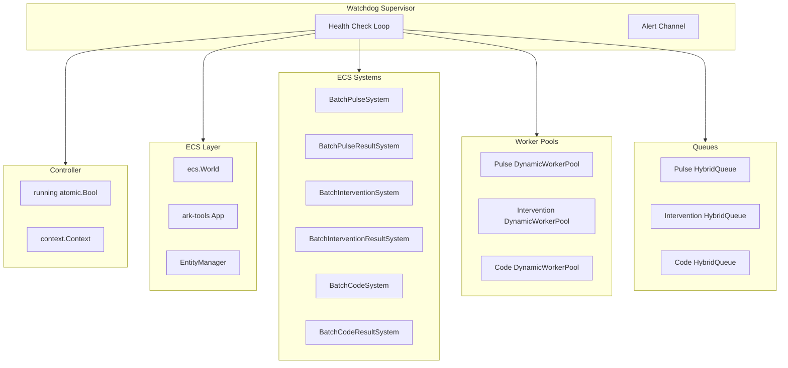

# CPRA Full System Watchdog Implementation Plan

## Overview

Add a comprehensive watchdog supervisor to CPRA that monitors **all system components**:
- Controller lifecycle and running state
- ECS World health (entity counts, memory, locked state)
- ark-tools App (tick rate, system execution)
- Worker Pools (pulse, intervention, code)
- Queues (depth, throughput, stalls)
- ECS Systems (batch processing, result handling)

Uses **thejerf/suture v4** for Erlang-style supervision with automatic restart.

## All CPRA Components to Monitor



## Component Health Checks

| Component | Health Metric | Unhealthy Condition | Action |
|-----------|--------------|---------------------|--------|
| **Controller** | `running.Load()` | false when expected true | Alert, attempt restart |
| **ECS World** | `world.Stats().Locked` | Locked for >30s | Alert (cannot restart) |
| **ECS World** | `world.Stats().Entities.Used` | Drops to 0 unexpectedly | Alert |
| **ark-tools App** | `runDone` channel | Closed unexpectedly | Restart app loop |
| **Worker Pool** | `Stats().TasksCompleted` | Stalled (no change) with queue > 0 | Restart pool |
| **Worker Pool** | `Stats().RunningWorkers` | 0 with pending tasks | Restart pool |
| **Queue** | `Stats().QueueDepth` | >90% capacity sustained | Warning |
| **Queue** | `Stats().Dropped` | Increasing | Warning |
| **ECS System** | Tick execution | No ticks for N intervals | Alert |

## Library Selection

| Library | Purpose | Usage |
|---------|---------|-------|
| **github.com/thejerf/suture/v4** | Service supervision | Supervises restartable components |
| **github.com/sasha-s/go-deadlock** | Mutex deadlock detection | Dev builds only (build tag) |
| **github.com/raulk/go-watchdog** | Memory/GC watchdog | Optional OOM protection |

## New File: `internal/controller/watchdog.go`

```go
package controller

import (
    "context"
    "sync"
    "sync/atomic"
    "time"

    "github.com/thejerf/suture/v4"
    "go.uber.org/zap"
)

// ComponentStatus represents the health state of a monitored component
type ComponentStatus int

const (
    StatusHealthy ComponentStatus = iota
    StatusDegraded
    StatusUnhealthy
    StatusRestarting
    StatusFailed
)

// ComponentHealth holds health metrics for a component
type ComponentHealth struct {
    Name           string
    Status         ComponentStatus
    LastCheck      time.Time
    LastHealthy    time.Time
    ConsecutiveFails int
    Metrics        map[string]interface{}
    Error          error
}

// HealthChecker is implemented by components that can report health
type HealthChecker interface {
    HealthCheck() ComponentHealth
}

// Restartable is implemented by components that can be restarted
type Restartable interface {
    Restart(ctx context.Context) error
}

// WatchdogConfig configures the watchdog behavior
type WatchdogConfig struct {
    Enabled              bool
    CheckInterval        time.Duration // How often to check health (default: 5s)
    FailureThreshold     int           // Consecutive failures before action (default: 3)
    
    // Suture supervisor settings
    SutureFailureThreshold float64       // Failures before backoff (default: 5)
    SutureFailureDecay     float64       // Decay rate in seconds (default: 30)
    SutureFailureBackoff   time.Duration // Backoff duration (default: 15s)
    SutureTimeout          time.Duration // Service stop timeout (default: 10s)
    
    // Component-specific thresholds
    PoolStallThreshold     int           // Ticks without progress (default: 6 = 30s)
    QueueCapacityWarning   float64       // Warn at this % capacity (default: 0.9)
    WorldLockTimeout       time.Duration // Alert if world locked > this (default: 30s)
    
    // Restart limits
    MaxRestarts            int           // Max restarts per component (default: 3)
    RestartWindow          time.Duration // Window for counting restarts (default: 5m)
}

func DefaultWatchdogConfig() WatchdogConfig {
    return WatchdogConfig{
        Enabled:              true,
        CheckInterval:        5 * time.Second,
        FailureThreshold:     3,
        SutureFailureThreshold: 5.0,
        SutureFailureDecay:     30.0,
        SutureFailureBackoff:   15 * time.Second,
        SutureTimeout:          10 * time.Second,
        PoolStallThreshold:     6,
        QueueCapacityWarning:   0.9,
        WorldLockTimeout:       30 * time.Second,
        MaxRestarts:            3,
        RestartWindow:          5 * time.Minute,
    }
}

// Watchdog monitors all CPRA system components
type Watchdog struct {
    supervisor   *suture.Supervisor
    controller   *Controller
    logger       *zap.SugaredLogger
    config       WatchdogConfig
    
    // Health state tracking
    components   map[string]*componentState
    mu           sync.RWMutex
    
    // Alerts channel for external consumers
    Alerts       chan ComponentHealth
    
    ctx          context.Context
    cancel       context.CancelFunc
}

type componentState struct {
    health       ComponentHealth
    lastMetrics  interface{}  // Previous metrics for delta detection
    restarts     []time.Time  // Restart timestamps within window
}

// NewWatchdog creates a watchdog for the given controller
func NewWatchdog(ctrl *Controller, config WatchdogConfig, logger *zap.SugaredLogger) *Watchdog {
    spec := suture.Spec{
        FailureThreshold: config.SutureFailureThreshold,
        FailureDecay:     config.SutureFailureDecay,
        FailureBackoff:   config.SutureFailureBackoff,
        Timeout:          config.SutureTimeout,
        Log: func(msg string) {
            logger.Infow("suture", "msg", msg)
        },
    }
    
    return &Watchdog{
        supervisor: suture.New("cpra-watchdog", spec),
        controller: ctrl,
        logger:     logger,
        config:     config,
        components: make(map[string]*componentState),
        Alerts:     make(chan ComponentHealth, 100),
    }
}
```

## Health Check Service (runs inside supervisor)

```go
// HealthCheckService implements suture.Service for periodic health checks
type HealthCheckService struct {
    watchdog *Watchdog
}

func (s *HealthCheckService) Serve(ctx context.Context) error {
    ticker := time.NewTicker(s.watchdog.config.CheckInterval)
    defer ticker.Stop()
    
    for {
        select {
        case <-ctx.Done():
            return nil
        case <-ticker.C:
            s.watchdog.checkAllComponents()
        }
    }
}

func (w *Watchdog) checkAllComponents() {
    // 1. Check Controller state
    w.checkController()
    
    // 2. Check ECS World
    w.checkWorld()
    
    // 3. Check ark-tools App
    w.checkApp()
    
    // 4. Check Worker Pools
    w.checkPool("pulse", w.controller.pulsePool)
    w.checkPool("intervention", w.controller.interventionPool)
    w.checkPool("code", w.controller.codePool)
    
    // 5. Check Queues
    w.checkQueue("pulse", w.controller.pulseQueue)
    w.checkQueue("intervention", w.controller.interventionQueue)
    w.checkQueue("code", w.controller.codeQueue)
}

func (w *Watchdog) checkController() {
    health := ComponentHealth{
        Name:      "controller",
        LastCheck: time.Now(),
        Metrics:   make(map[string]interface{}),
    }
    
    running := w.controller.running.Load()
    health.Metrics["running"] = running
    
    if !running && w.controller.ctx != nil && w.controller.ctx.Err() == nil {
        // Controller should be running but isn't
        health.Status = StatusUnhealthy
        health.Error = fmt.Errorf("controller not running")
        w.recordHealth("controller", health)
        return
    }
    
    health.Status = StatusHealthy
    health.LastHealthy = time.Now()
    w.recordHealth("controller", health)
}

func (w *Watchdog) checkWorld() {
    health := ComponentHealth{
        Name:      "world",
        LastCheck: time.Now(),
        Metrics:   make(map[string]interface{}),
    }
    
    stats := w.controller.world.Stats()
    health.Metrics["entities_used"] = stats.Entities.Used
    health.Metrics["entities_total"] = stats.Entities.Total
    health.Metrics["memory_used"] = stats.MemoryUsed
    health.Metrics["locked"] = stats.Locked
    health.Metrics["archetypes"] = len(stats.Archetypes)
    
    // Check for locked world (indicates deadlock or long operation)
    if stats.Locked {
        w.mu.Lock()
        state := w.components["world"]
        if state != nil && state.health.Metrics["locked"] == true {
            // Was locked last check too - check duration
            lockDuration := time.Since(state.health.LastHealthy)
            if lockDuration > w.config.WorldLockTimeout {
                health.Status = StatusUnhealthy
                health.Error = fmt.Errorf("world locked for %v", lockDuration)
            } else {
                health.Status = StatusDegraded
            }
        }
        w.mu.Unlock()
    } else {
        health.Status = StatusHealthy
        health.LastHealthy = time.Now()
    }
    
    w.recordHealth("world", health)
}

func (w *Watchdog) checkPool(name string, pool *queue.DynamicWorkerPool) {
    health := ComponentHealth{
        Name:      name + "-pool",
        LastCheck: time.Now(),
        Metrics:   make(map[string]interface{}),
    }
    
    stats := pool.Stats()
    health.Metrics["running_workers"] = stats.RunningWorkers
    health.Metrics["capacity"] = stats.CurrentCapacity
    health.Metrics["tasks_submitted"] = stats.TasksSubmitted
    health.Metrics["tasks_completed"] = stats.TasksCompleted
    health.Metrics["pending_results"] = stats.PendingResults
    
    // Detect stall: tasks submitted but no completion progress
    w.mu.Lock()
    state := w.components[name+"-pool"]
    if state != nil {
        prevCompleted, _ := state.lastMetrics.(int64)
        if stats.TasksSubmitted > stats.TasksCompleted && 
           stats.TasksCompleted == prevCompleted {
            // No progress
            state.health.ConsecutiveFails++
            if state.health.ConsecutiveFails >= w.config.PoolStallThreshold {
                health.Status = StatusUnhealthy
                health.Error = fmt.Errorf("pool stalled: %d tasks pending, no progress for %d checks",
                    stats.TasksSubmitted-stats.TasksCompleted, state.health.ConsecutiveFails)
            } else {
                health.Status = StatusDegraded
            }
        } else {
            health.Status = StatusHealthy
            health.LastHealthy = time.Now()
            health.ConsecutiveFails = 0
        }
    } else {
        health.Status = StatusHealthy
        health.LastHealthy = time.Now()
    }
    w.mu.Unlock()
    
    // Check zero workers with pending work
    if stats.RunningWorkers == 0 && stats.TasksSubmitted > stats.TasksCompleted {
        health.Status = StatusUnhealthy
        health.Error = fmt.Errorf("zero workers with %d pending tasks",
            stats.TasksSubmitted-stats.TasksCompleted)
    }
    
    w.recordHealth(name+"-pool", health)
}

func (w *Watchdog) checkQueue(name string, q queue.Queue) {
    health := ComponentHealth{
        Name:      name + "-queue",
        LastCheck: time.Now(),
        Metrics:   make(map[string]interface{}),
    }
    
    stats := q.Stats()
    health.Metrics["depth"] = stats.QueueDepth
    health.Metrics["capacity"] = stats.Capacity
    health.Metrics["enqueued"] = stats.Enqueued
    health.Metrics["dequeued"] = stats.Dequeued
    health.Metrics["dropped"] = stats.Dropped
    
    // Check capacity
    if stats.Capacity > 0 {
        utilization := float64(stats.QueueDepth) / float64(stats.Capacity)
        health.Metrics["utilization"] = utilization
        
        if utilization > w.config.QueueCapacityWarning {
            health.Status = StatusDegraded
            health.Error = fmt.Errorf("queue at %.0f%% capacity", utilization*100)
        } else {
            health.Status = StatusHealthy
            health.LastHealthy = time.Now()
        }
    }
    
    w.recordHealth(name+"-queue", health)
}
```

## Pool Service Wrapper (for suture supervision)

```go
// PoolService wraps a DynamicWorkerPool as a suture.Service
type PoolService struct {
    Name       string
    Queue      queue.Queue
    Config     queue.WorkerPoolConfig
    Pool       *queue.DynamicWorkerPool
    CreateFunc func(context.Context) (*queue.DynamicWorkerPool, error)
    Logger     *zap.SugaredLogger
    mu         sync.Mutex
}

func (s *PoolService) String() string { return s.Name }

func (s *PoolService) Serve(ctx context.Context) error {
    s.mu.Lock()
    pool, err := s.CreateFunc(ctx)
    if err != nil {
        s.mu.Unlock()
        return fmt.Errorf("failed to create %s pool: %w", s.Name, err)
    }
    s.Pool = pool
    s.mu.Unlock()
    
    pool.Start()
    s.Logger.Infof("%s started under supervision", s.Name)
    
    // Block until context canceled
    <-ctx.Done()
    
    // Cleanup
    pool.DrainAndStop()
    s.Logger.Infof("%s stopped", s.Name)
    return nil
}

func (s *PoolService) GetPool() *queue.DynamicWorkerPool {
    s.mu.Lock()
    defer s.mu.Unlock()
    return s.Pool
}
```

## Controller Integration

### Changes to [`controller.go`](internal/controller/controller.go)

```go
type Controller struct {
    // ... existing fields ...
    watchdog *Watchdog  // NEW
}

type Config struct {
    // ... existing fields ...
    WatchdogConfig WatchdogConfig  // NEW
}

func NewController(config Config) (*Controller, error) {
    // ... existing initialization ...
    
    ctrl := &Controller{
        // ... existing fields ...
    }
    
    // Create watchdog if enabled
    if config.WatchdogConfig.Enabled {
        ctrl.watchdog = NewWatchdog(ctrl, config.WatchdogConfig, ctrlLogger)
    }
    
    return ctrl, nil
}

func (c *Controller) Start(ctx context.Context) error {
    // ... existing start logic ...
    
    // Start watchdog supervisor
    if c.watchdog != nil {
        errCh := c.watchdog.Start(c.ctx)
        go func() {
            for err := range errCh {
                c.logger.Errorf("Watchdog error: %v", err)
            }
        }()
    }
    
    return nil
}

func (c *Controller) Stop() {
    // Stop watchdog first (before draining pools)
    if c.watchdog != nil {
        c.watchdog.Stop()
    }
    
    // ... existing stop logic ...
}
```

## Files to Create/Modify

1. **`internal/controller/watchdog.go`** (NEW)
   - `WatchdogConfig`, `Watchdog`, `ComponentHealth`
   - `HealthCheckService` (suture.Service)
   - `PoolService` wrapper
   - Health check functions for all components

2. **`internal/controller/controller.go`** (MODIFY)
   - Add `watchdog *Watchdog` field
   - Add `WatchdogConfig` to `Config`
   - Integrate watchdog in `Start()` and `Stop()`

3. **`internal/controller/logger.go`** (MODIFY)
   - Add `WatchdogLogger *zap.SugaredLogger`

4. **`go.mod`** (MODIFY)
   - Add `github.com/thejerf/suture/v4`

## Optional Enhancements

### go-deadlock for Development

```go
//go:build deadlock

package controller

import "github.com/sasha-s/go-deadlock"

type Mutex = deadlock.Mutex
type RWMutex = deadlock.RWMutex
```

### Memory Watchdog (go-watchdog)

```go
import "github.com/raulk/go-watchdog"

func (w *Watchdog) initMemoryWatchdog() {
    err, stop := watchdog.SystemDriven(0, 0)
    if err != nil {
        w.logger.Warnf("Memory watchdog failed: %v", err)
    }
    w.memoryWatchdogStop = stop
}
```

## Alert Handling Example

```go
// In main.go or operator code
go func() {
    for alert := range ctrl.watchdog.Alerts {
        switch alert.Status {
        case StatusUnhealthy:
            log.Printf("CRITICAL: %s unhealthy: %v", alert.Name, alert.Error)
            // Send to PagerDuty, etc.
        case StatusDegraded:
            log.Printf("WARNING: %s degraded: %v", alert.Name, alert.Error)
        }
    }
}()
```
