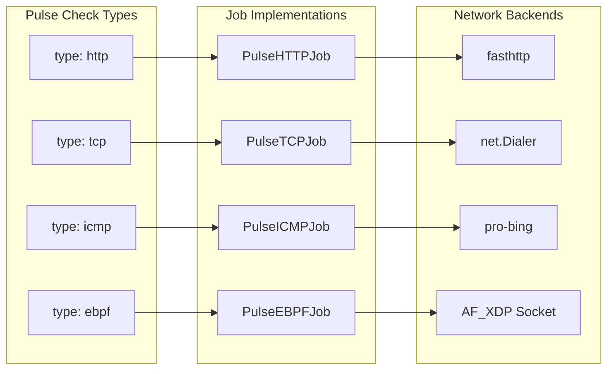

# ping-ebpf: New High-Performance Pulse Check Type

## Overview

Add a **new pulse check type** called `ebpf` that uses AF_XDP for ultra-high-throughput ICMP pings. This is **separate** from the existing `icmp` check type (which continues to use pro-bing).

## Why a Separate Check Type?

| Type | Backend | PPS | Requirements |
|------|---------|-----|--------------|
| `icmp` | pro-bing | ~700k | None (unprivileged UDP) |
| `ebpf` | AF_XDP | ~2.6M | Linux, CAP_NET_RAW, XDP-capable NIC |

Users choose based on their deployment constraints.

## Architecture



## YAML Configuration

```yaml
monitors:
  high-perf-server:
    pulse:
      type: ebpf              # NEW type
      config:
        host: 10.0.0.1
        interface: eth0       # Required: NIC for AF_XDP
        count: 1
        retries: 2
      interval: 1s
      timeout: 500ms
```

## Implementation

### Phase 1: Schema - Add `PulseEBPFConfig`

In `internal/loader/schema/manifest.go`:

```go
type PulseEBPFConfig struct {
    Host      string `yaml:"host"`
    Interface string `yaml:"interface"`  // Required: NIC name
    Count     int    `yaml:"count"`
    Retries   int    `yaml:"retries"`
}
```

Add case `"ebpf"` in `UnmarshalYAML` and `UnmarshalJSON`.

### Phase 2: Create `internal/ping-ebpf` Package

| File | Purpose |
|------|---------|
| `pinger.go` | `Pinger` struct, `New()`, `Ping()`, `Close()` |
| `xdp.go` | AF_XDP socket init via `github.com/asavie/xdp` |
| `packet.go` | Build raw ICMP packets (Eth+IP+ICMP headers) |
| `umem.go` | UMEM buffer pool for zero-copy |
| `doc.go` | Package documentation |

### Phase 3: Job - Add `PulseEBPFJob`

In `internal/jobs/jobs.go`:

```go
type PulseEBPFJob struct {
    EnqueueTime time.Time
    StartTime   time.Time
    Host        string
    Interface   string
    JobType     string
    Driver      string
    Timeout     time.Duration
    Count       int
    Retries     int
    Entity      ecs.Entity
}
```

### Phase 4: Pool Integration

In `internal/jobs/pool.go`: Add `pulseEBPFJobPool` and factory functions.

In `CreatePulseJob`: Add case for `*schema.PulseEBPFConfig`.

### Phase 5: String Interning

Add `internedEBPF = interning.Intern("ebpf")` for the driver name.

## Dependencies to Add

- `github.com/asavie/xdp` - AF_XDP socket bindings
- `github.com/vishvananda/netlink` - Interface info (MAC, IP)

## Files Summary

**Modify:**
- `internal/loader/schema/manifest.go` - Add config type
- `internal/jobs/jobs.go` - Add job type
- `internal/jobs/pool.go` - Add pool
- `go.mod` - Add dependencies
- `docs/how-to/performance-tuning.md` - Document new type

**Create:**
- `internal/ping-ebpf/doc.go`
- `internal/ping-ebpf/pinger.go`
- `internal/ping-ebpf/xdp.go`
- `internal/ping-ebpf/packet.go`
- `internal/ping-ebpf/umem.go`
- `internal/ping-ebpf/pinger_test.go`

## To-Do List

1. Add `github.com/asavie/xdp` and `github.com/vishvananda/netlink` to go.mod
2. Add `PulseEBPFConfig` to `internal/loader/schema/manifest.go` with YAML/JSON unmarshal
3. Create `internal/ping-ebpf/doc.go` with package documentation
4. Create `internal/ping-ebpf/pinger.go` with Pinger struct, New(), Ping(), Close()
5. Create `internal/ping-ebpf/xdp.go` with AF_XDP socket initialization
6. Create `internal/ping-ebpf/packet.go` with ICMP packet builder (Eth+IP+ICMP)
7. Create `internal/ping-ebpf/umem.go` with UMEM buffer pool
8. Add `PulseEBPFJob` struct and Execute() to `internal/jobs/jobs.go`
9. Add `pulseEBPFJobPool` and factory to `internal/jobs/pool.go`
10. Add `internedEBPF` string and integrate in CreatePulseJob
11. Create `internal/ping-ebpf/pinger_test.go` with tests and benchmarks
12. Update `docs/how-to/performance-tuning.md` with ebpf pulse type

## References

- [High-Speed Packet Transmission in Go](https://toonk.io/sending-network-packets-in-go/) - AF_XDP benchmarks
- [github.com/asavie/xdp](https://github.com/asavie/xdp) - Go AF_XDP library
- [XDP Documentation](https://www.kernel.org/doc/html/latest/networking/af_xdp.html) - Kernel docs
